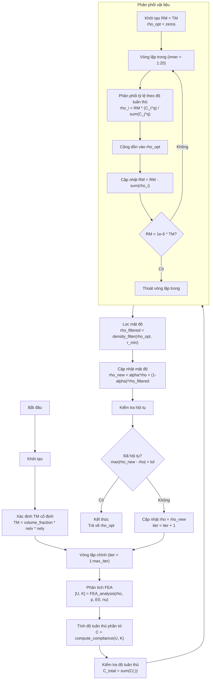

# **BÁO CÁO THUẬT TOÁN PTOc**

(Proportional Topology Optimization for Minimum-Compliance Problems)

## **1. Giới thiệu chung**

Tối ưu hóa topo (Topology Optimization – TO) là phương pháp tìm phân bố vật liệu tối ưu trong miền thiết kế nhằm đạt được đặc tính cơ học mong muốn. Một trong những bài toán phổ biến nhất là **tối thiểu hóa độ tuân thủ (compliance)** – tương ứng với **tối đa độ cứng** của cấu trúc – dưới ràng buộc **thể tích**.

Thuật toán **Proportional Topology Optimization for compliance (PTOc)** là một phương pháp **không dựa trên đạo hàm (non-sensitivity method)**, cho phép giải bài toán tối ưu hóa tuân thủ mà không cần tính đạo hàm độ nhạy phức tạp như SIMP/OC. PTOc đơn giản, ổn định và dễ lập trình, đặc biệt phù hợp cho các mô hình tầm nhỏ và trung bình.

Mục tiêu của PTOc:

* **Tối thiểu hóa độ tuân thủ C**
* **Duy trì phân số thể tích vật liệu đúng bằng giá trị cho trước**

---

## **2. Các tham số đầu vào của bài toán**

### **2.1. Tham số vật liệu và phân tích cấu trúc**

| Tham số                               | Ý nghĩa                                           | Mã MATLAB |
| ------------------------------------- | ------------------------------------------------- | --------- |
| `E0`                                  | Modul Young của vật liệu đặc                      | `E0 = 1.0` |
| `E_min`                               | Modul Young của phần tử rỗng để tránh singularity | `E_min = 1e-9 * E0` |
| `nu`                                  | Hệ số Poisson                                     | `nu = 0.3` |
| `p`                                   | Hệ số phạt trong SIMP sửa đổi (thường = 3)        | `p = 3` |
| `rho_min`, `rho_max`                  | Cận mật độ phần tử                                | `rho_min = 1e-3`, `rho_max = 1.0` |

---

### **2.2. Tham số lưới FE**

| Tham số            | Ý nghĩa                         | Mã MATLAB |
| ------------------ | ------------------------------- | --------- |
| `nelx`             | Số phần tử theo trục x          | `nelx = 60` |
| `nely`             | Số phần tử theo trục y          | `nely = 30` |
| `dx`, `dy`         | Kích thước phần tử (mặc định đơn vị) | `dx = 1`, `dy = 1` |

---

### **2.3. Tham số tải trọng**

| Tham số        | Ý nghĩa                                        | Mã MATLAB |
| -------------- | ---------------------------------------------- | --------- |
| `load_dofs`    | Bậc tự do chịu tải                             | `load_dofs = [dof_index]` |
| `load_vals`    | Giá trị tải trọng                              | `load_vals = -1` |
| `fixed_dofs`   | Bậc tự do bị khóa (điều kiện biên)             | `fixed_dofs = 1:2*(nely+1)` |

---

### **2.4. Tham số tối ưu hóa – điều khiển**

| Tham số             | Ý nghĩa                                                  | Mã MATLAB |
| ------------------- | -------------------------------------------------------- | --------- |
| `volume_fraction`   | Ràng buộc thể tích (volume fraction) – ràng buộc chính   | `volume_fraction = 0.4` |
| `q`                 | Hệ số tỷ lệ (tuỳ theo phần tử tuân thủ), tối ưu: **1.0** | `q = 1` |
| `alpha`             | Hệ số lịch sử, tối ưu: **0.3-0.5**                       | `alpha = 0.3` |
| `r_min`             | Bán kính bộ lọc mật độ                                   | `r_min = 1.5` |
| `max_iter`          | Số vòng lặp tối đa                                       | `max_iter = 200` |

PTOc khác với PTOs chủ yếu ở:

* TM trong PTOc là **cố định** (ràng buộc thể tích không thay đổi)
* Phân phối vật liệu dựa trên **độ tuân thủ phần tử**, không phải ứng suất
* Tiêu chí hội tụ dựa trên **thay đổi mật độ**, không phải ứng suất

---

# **3. Mục tiêu tối ưu hóa**

Bài toán được phát biểu:

```matlab
% Mục tiêu: Tối thiểu hóa độ tuân thủ
minimize: C = U' * K * U

% Ràng buộc thể tích:
sum(rho(:)) = volume_fraction * nelx * nely

% Ràng buộc biên:
rho_min <= rho(i) <= rho_max
```

---

# **4. Sơ đồ thuật toán PTOc**



---

## **5. Quy trình thuật toán PTOc chi tiết**

### **5.1. Bước 1 – Thiết lập và Xác định TM**

```matlab
% Khởi tạo mật độ đều
rho = ones(nely, nelx) * volume_fraction;
rho = max(rho_min, min(rho_max, rho));

% Thiết lập điều kiện biên (tương tự PTOs)
fixed_dofs = 1:2*(nely+1);  % Cạnh trái cố định
load_node = (nelx+1)*(nely+1);
load_dof = 2*load_node;
load_dofs = load_dof;
load_vals = -1;  % Tải hướng xuống

% Xác định TM cố định
TM = volume_fraction * nelx * nely;  % Không thay đổi trong suốt quá trình
```

---

### **5.2. Vòng lặp chính (Main Loop)**

#### **2.1. Phân tích FE và tính độ tuân thủ**

```matlab
% Giải hệ phương trình cân bằng
[U, K_global] = FEA_analysis(nelx, nely, rho, p, E0, nu, load_dofs, load_vals, fixed_dofs);

% Tính độ tuân thủ phần tử
C = compute_compliance(nelx, nely, rho, p, E0, nu, U, K_global);
C_total = sum(C(:));  % Hoặc C_total = U' * K_global * U
```

#### **2.2. Vòng lặp trong – Phân phối vật liệu**

```matlab
RM = TM;  % Vật liệu còn lại
rho_opt = zeros(nely, nelx);

for inner = 1:20
    % Phân phối tỷ lệ theo độ tuân thủ
    rho_opt_iter = material_distribution_PTOc(C, RM, q, rho_min, rho_max);
    
    % Tính tổng vật liệu đã phân phối
    allocated = sum(rho_opt_iter(:));
    
    % Cập nhật vật liệu còn lại
    RM = RM - allocated;
    
    % Cộng dồn vào mật độ tối ưu
    rho_opt = rho_opt + rho_opt_iter;
    
    % Dừng nếu RM rất nhỏ
    if RM < 1e-6 * TM
        break;
    end
end
```

Công thức phân phối trong `material_distribution_PTOc`:

```matlab
% Tính trọng số dựa trên độ tuân thủ
weighted_C = C.^q;
total_weight = sum(weighted_C(:));

% Phân phối tỷ lệ
rho_opt = RM * weighted_C / total_weight;

% Áp dụng giới hạn
rho_opt = max(rho_min, min(rho_max, rho_opt));
```

#### **2.3. Lọc mật độ**

```matlab
rho_filtered = density_filter(rho_opt, r_min, nelx, nely, dx, dy);
```

Bộ lọc hình nón với bán kính `r_min` (giống PTOs):

```matlab
% Kernel hình nón
dist = sqrt((ii*dx).^2 + (jj*dy).^2);
kernel = max(0, r_min - dist);
kernel = kernel / sum(kernel(:));  % Chuẩn hóa

% Áp dụng convolution
rho_filtered = conv2(rho_opt, kernel, 'same');
```

#### **2.4. Cập nhật mật độ với move limit**

```matlab
rho_new = update_density(rho, rho_filtered, alpha, rho_min, rho_max);
```

Công thức cập nhật:

```matlab
rho_new = alpha * rho_prev + (1 - alpha) * rho_opt;
```

#### **2.5. Kiểm tra hội tụ**

```matlab
% Tính thay đổi mật độ
change = max(abs(rho_new(:) - rho(:)));

% Kiểm tra điều kiện hội tụ cho PTOc
converged = change < 1e-3;  % Chỉ dựa trên thay đổi mật độ

% Hoặc sử dụng hàm check_convergence
[converged, change] = check_convergence(rho_new, rho, iter, max_iter, 1e-3, 'PTOc');
```

---

## **6. So sánh PTOc và PTOs**

| Đặc điểm | PTOc (Minimum Compliance) | PTOs (Stress-Constrained) |
|----------|---------------------------|---------------------------|
| **Mục tiêu** | Tối thiểu hóa độ tuân thủ | Tối thiểu hóa thể tích |
| **Ràng buộc chính** | Thể tích cố định | Ứng suất không vượt giới hạn |
| **TM (Target Material)** | Cố định | Điều chỉnh theo ứng suất |
| **Phân phối vật liệu** | Theo độ tuân thủ C^q | Theo ứng suất σ^q |
| **Tiêu chí hội tụ** | Thay đổi mật độ | Ứng suất trong dải + thay đổi mật độ |
| **Tham số q** | q = 1 (tuyến tính) | q = 1-2 (phi tuyến) |
| **Hệ số alpha** | alpha = 0.3-0.5 | alpha = 0.3-0.5 |

---

## **7. Đặc điểm nổi bật của PTOc**

### **Ưu điểm**

✔ Không cần đạo hàm → lập trình đơn giản  
✔ Điều khiển đơn giản hơn OC hoặc SIMP-OC  
✔ Đảm bảo đúng ràng buộc thể tích  
✔ Dễ lập trình, dễ kiểm soát ổn định  
✔ Kết quả tương đương các phương pháp gradient-based  

### **Nhược điểm**

✘ Không đảm bảo nghiệm tối ưu toàn cục  
✘ Dễ bị phụ thuộc vào bộ lọc  
✘ Chậm hơn OC trong bài toán lớn  

---

## **8. Kết luận**

PTOc là một thuật toán tối ưu hóa topo đơn giản nhưng mạnh mẽ, có thể đạt kết quả gần tương đương với các phương pháp dựa trên đạo hàm mà không phải xử lý độ nhạy phức tạp. Với cơ chế phân phối vật liệu dựa trên độ tuân thủ phần tử, PTOc duy trì độ ổn định cao và dễ áp dụng trong thực hành, đặc biệt cho các bài toán tiêu chuẩn như dầm MBB.