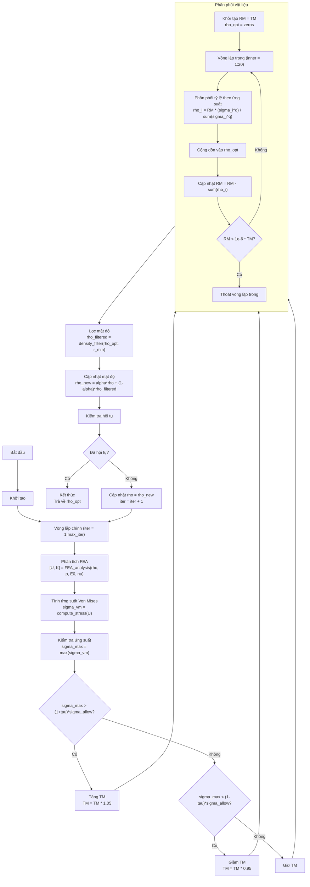

# **BÁO CÁO THUẬT TOÁN PTOs**

(Proportional Topology Optimization for Stress-Constrained Problems)

## **1. Giới thiệu chung**

Tối ưu hóa topo (Topology Optimization – TO) là lĩnh vực nghiên cứu nhằm tìm phân bố vật liệu tối ưu trong miền thiết kế, sao cho cấu trúc thu được đáp ứng các ràng buộc cơ học và tối ưu một đại lượng mục tiêu cụ thể. Một trong những bài toán quan trọng là **tối ưu hóa cấu trúc dưới ràng buộc ứng suất** (stress-constrained topology optimization), vốn thường khó giải vì cần tính toán đạo hàm độ nhạy (sensitivities) phức tạp.

Thuật toán **Proportional Topology Optimization for stress constraints (PTOs)** là một tiếp cận **không dựa trên đạo hàm (non-sensitivity method)**, nhờ đó đơn giản, dễ lập trình, ổn định và phù hợp cho các mô hình tầm trung trong thực hành.

Mục tiêu của PTOs:

* **Tối thiểu hóa phân số thể tích** (volume fraction)
* **Đảm bảo ứng suất Von Mises trong cấu trúc không vượt quá giới hạn cho phép**

Thuật toán hoạt động bằng cách phân phối lại vật liệu **tỷ lệ với mức độ ứng suất** của từng phần tử và điều chỉnh lượng vật liệu tổng sao cho ứng suất lớn nhất hội tụ về giá trị giới hạn.

---

## **2. Các tham số đầu vào của bài toán**

Phương pháp PTOs yêu cầu thiết lập một số nhóm tham số:

### **2.1. Tham số vật liệu và phân tích cấu trúc**

| Tham số                               | Ý nghĩa                                                             | Mã MATLAB |
| ------------------------------------- | ------------------------------------------------------------------- | --------- |
| `E0`                                  | Modul Young của vật liệu rắn                                        | `E0 = 1.0` |
| `E_min`                               | Modul Young của phần tử rỗng dùng để tránh ma trận độ cứng singular | `E_min = 1e-9 * E0` |
| `nu`                                  | Hệ số Poisson                                                       | `nu = 0.3` |
| `p`                                   | Hệ số phạt trong công thức SIMP sửa đổi (thường = 3)                | `p = 3` |
| `rho_min`, `rho_max`                  | Cận dưới – cận trên của mật độ phần tử                              | `rho_min = 1e-3`, `rho_max = 1.0` |

---

### **2.2. Tham số lưới phần tử hữu hạn**

| Tham số            | Ý nghĩa                                   | Mã MATLAB |
| ------------------ | ----------------------------------------- | --------- |
| `nelx`             | Số phần tử theo trục x                    | `nelx = 60` |
| `nely`             | Số phần tử theo trục y                    | `nely = 30` |
| `dx`, `dy`         | Kích thước phần tử (mặc định đơn vị)      | `dx = 1`, `dy = 1` |

---

### **2.3. Tham số tải trọng và ràng buộc ứng suất**

| Tham số        | Ý nghĩa                                        | Mã MATLAB |
| -------------- | ---------------------------------------------- | --------- |
| `load_dofs`    | Bậc tự do chịu tải                             | `load_dofs = [dof_index]` |
| `load_vals`    | Giá trị tải trọng                              | `load_vals = -1` |
| `fixed_dofs`   | Bậc tự do bị khóa (điều kiện biên)             | `fixed_dofs = 1:2*(nely+1)` |
| `sigma_allow`  | Giới hạn ứng suất Von Mises (ràng buộc chính)  | `sigma_allow = 1` |

---

### **2.4. Tham số tối ưu hóa và điều khiển**

| Tham số    | Ý nghĩa                                                              | Mã MATLAB |
| ---------- | -------------------------------------------------------------------- | --------- |
| `q`        | Số mũ tỷ lệ khi phân phối vật liệu theo ứng suất (tối ưu: `q = 1`)   | `q = 1` |
| `r_min`    | Bán kính bộ lọc mật độ                                               | `r_min = 1.5` |
| `alpha`    | Hệ số lịch sử (move limit)                                           | `alpha = 0.3` |
| `tau`      | Dải dung sai ứng suất                                                | `tau = 0.05` |
| `max_iter` | Số vòng lặp tối đa                                                   | `max_iter = 200` |
| `TM_init`  | Lượng vật liệu mục tiêu ban đầu                                      | `TM_init = 0.4 * nelx * nely` |

---

## **3. Mục tiêu tối ưu hóa**

PTOs giải bài toán:

```matlab
% Mục tiêu: Tối thiểu hóa thể tích
minimize: V = sum(rho(:))

% Ràng buộc: Ứng suất không vượt quá giới hạn
subject to: sigma_vm(i) <= sigma_allow for all i

% Ràng buộc biên:
rho_min <= rho(i) <= rho_max
```

Thuật toán không tìm đạo hàm mà điều chỉnh vật liệu dựa trên quan sát ứng suất.

---

# **4. Sơ đồ thuật toán PTOs**



---

## **5. Quy trình thuật toán PTOs chi tiết**

Thuật toán bao gồm **vòng lặp chính** và **vòng lặp phân phối vật liệu** (inner loop). Dưới đây là mô tả chi tiết.

### **5.1. Bước 1 – Thiết lập (Setup)**

```matlab
% Khởi tạo mật độ đều
rho = ones(nely, nelx) * TM_init / (nelx * nely);
rho = max(rho_min, min(rho_max, rho));

% Thiết lập điều kiện biên
fixed_dofs = 1:2*(nely+1);  % Cạnh trái cố định
load_node = (nelx+1)*(nely+1);
load_dof = 2*load_node;
load_dofs = load_dof;
load_vals = -1;  % Tải hướng xuống
```

---

### **5.2. Bước 2 – Vòng lặp chính (Main Loop)**

Vòng lặp tiếp tục cho đến khi ứng suất hội tụ gần giới hạn.

#### **2.1. Phân tích FE và phân tích ứng suất**

```matlab
% Giải hệ phương trình cân bằng
[U, K_global] = FEA_analysis(nelx, nely, rho, p, E0, nu, load_dofs, load_vals, fixed_dofs);

% Tính ứng suất Von Mises
sigma_vm = compute_stress(nelx, nely, rho, p, E0, nu, U);
sigma_max = max(sigma_vm(:));
```

Kết quả này dùng để quyết định phân phối vật liệu cho vòng lặp tiếp theo.

#### **2.2. Điều chỉnh lượng vật liệu mục tiêu (TM) dựa trên ứng suất**

```matlab
if sigma_max > (1 + tau) * sigma_allow
    % Ứng suất quá cao → cần thêm vật liệu
    TM = TM * 1.05;
elseif sigma_max < (1 - tau) * sigma_allow
    % Ứng suất quá thấp → có thể giảm vật liệu
    TM = TM * 0.95;
end
```

#### **2.3. Vòng lặp trong – Phân phối vật liệu**

```matlab
RM = TM;  % Vật liệu còn lại
rho_opt = zeros(nely, nelx);

for inner = 1:20
    % Phân phối tỷ lệ theo ứng suất
    rho_opt_iter = material_distribution_PTOs(sigma_vm, RM, q, 1.0, rho_min, rho_max);
    
    % Tính tổng vật liệu đã phân phối
    allocated = sum(rho_opt_iter(:));
    
    % Cập nhật vật liệu còn lại
    RM = RM - allocated;
    
    % Cộng dồn vào mật độ tối ưu
    rho_opt = rho_opt + rho_opt_iter;
    
    % Dừng nếu RM rất nhỏ
    if RM < 1e-6 * TM
        break;
    end
end
```

Công thức phân phối trong `material_distribution_PTOs`:

```matlab
% Tính trọng số dựa trên ứng suất
weighted_stress = sigma_vm.^q .* volume;  % volume thường = 1
total_weight = sum(weighted_stress(:));

% Phân phối tỷ lệ
rho_opt = RM * weighted_stress / total_weight;

% Áp dụng giới hạn
rho_opt = max(rho_min, min(rho_max, rho_opt));
```

#### **2.4. Lọc mật độ**

```matlab
rho_filtered = density_filter(rho_opt, r_min, nelx, nely, dx, dy);
```

Bộ lọc hình nón với bán kính `r_min`:

```matlab
% Kernel hình nón
dist = sqrt((ii*dx).^2 + (jj*dy).^2);
kernel = max(0, r_min - dist);
kernel = kernel / sum(kernel(:));  % Chuẩn hóa

% Áp dụng convolution
rho_filtered = conv2(rho_opt, kernel, 'same');
```

#### **2.5. Cập nhật mật độ với move limit**

```matlab
rho_new = update_density(rho, rho_filtered, alpha, rho_min, rho_max);
```

Công thức cập nhật:

```matlab
rho_new = alpha * rho_prev + (1 - alpha) * rho_opt;
```

#### **2.6. Kiểm tra hội tụ**

```matlab
% Tính thay đổi mật độ
change = max(abs(rho_new(:) - rho(:)));

% Kiểm tra điều kiện hội tụ cho PTOs
stress_lower = (1 - tau) * sigma_allow;
stress_upper = (1 + tau) * sigma_allow;
stress_ok = (sigma_max >= stress_lower) && (sigma_max <= stress_upper);
density_ok = change < 1e-3;

converged = stress_ok && density_ok;
```

---

## **6. Đặc điểm nổi bật của PTOs**

### **Ưu điểm**

✔ Không cần đạo hàm → lập trình đơn giản  
✔ Ổn định, ít tham số  
✔ Tránh được vấn đề mesh-dependence nhờ bộ lọc  
✔ Đạt kết quả tốt cho bài toán ứng suất vốn rất khó giải bằng phương pháp gradient  

### **Nhược điểm**

✘ Tính heuristic → không đảm bảo tối ưu toàn cục  
✘ Cần tinh chỉnh tham số TM để hội tụ tốt  
✘ Đôi khi hội tụ chậm khi ứng suất phân bố phức tạp  

---

## **7. Kết luận**

Thuật toán PTOs là một phương pháp đơn giản nhưng hiệu quả để tối ưu hóa topo dưới ràng buộc ứng suất. Nó đặc biệt phù hợp cho các ứng dụng:

* thiết kế dầm chịu tải,
* chi tiết máy yêu cầu tối ưu khối lượng,
* các cấu trúc ít phức tạp nhưng cần ràng buộc ứng suất chặt chẽ.

Với việc không đòi hỏi đạo hàm và áp dụng cơ chế phân phối vật liệu tỷ lệ theo ứng suất, PTOs trở thành một công cụ mạnh mẽ và dễ áp dụng trong thực hành.

